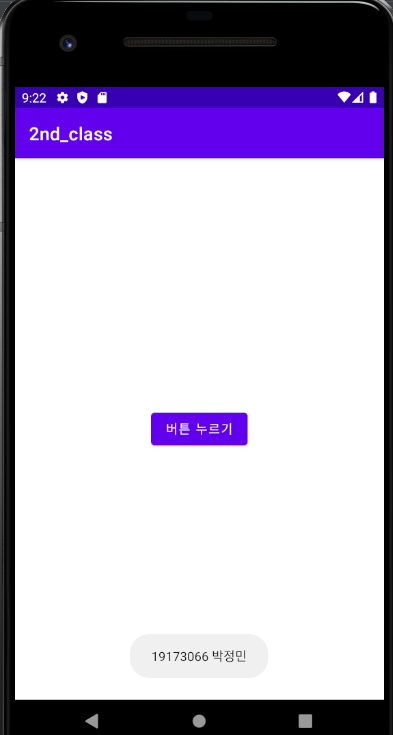
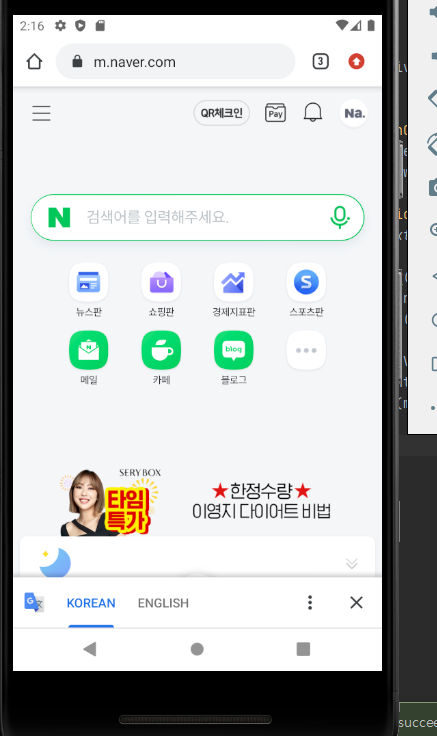
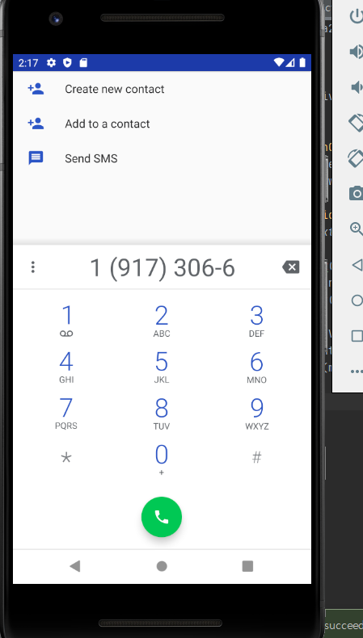
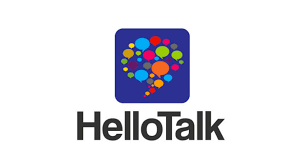
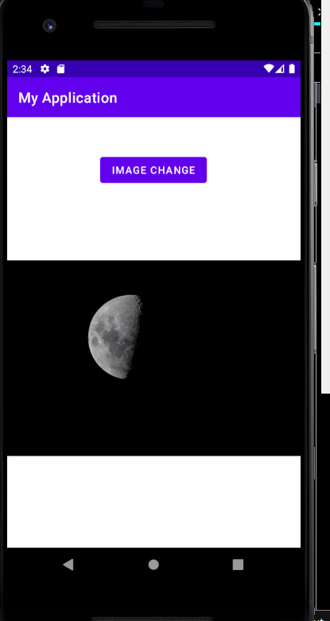
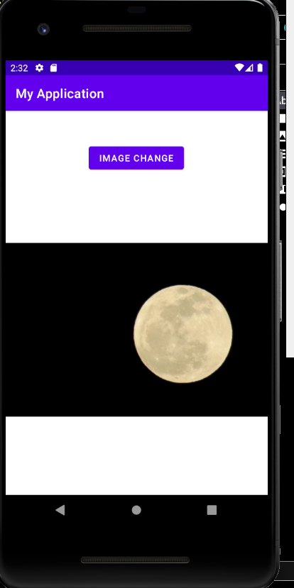
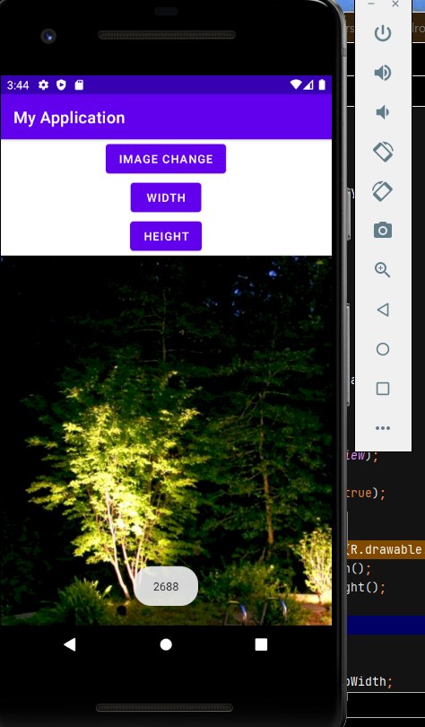
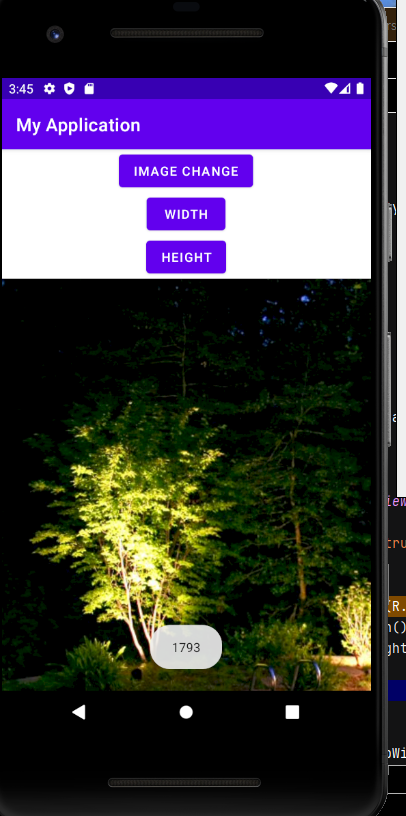
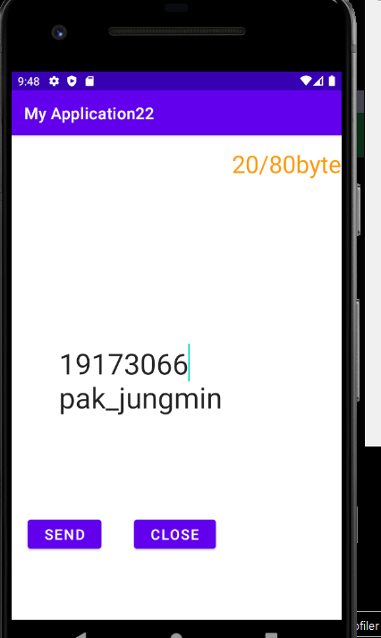

# 19173066_박정민

## 1주차
  - OT

## 2주차
  - 2주차 과제
    - 결과화면 </img>

## 3주차
  - 3주차 과제
    - 네이버 결과화면 </img>
    - 전화화면 </img>
## 4주차
   - 아이디어 앱
  </img>
   <h6>위에 hellotalk이란 앱은 제가 언어 공부를 하면서 외국인 친구들을 사귀고 싶을 때 많이 사용하는 앱으로
   인스타그램처럼 개인이 올리고 싶은 글이나 사진, 영상 등을 올릴 수 있고
   또 각자의 모국어와 배우고 싶은 언어가 프로필에 나와 있어 언어교환을 할 친구를 찾기에도 편리합니다.
   하지만 저는 외국인 친구를 사귀는 용도 외에도 외국어 공부를 하다가 모르는 부분이 생겼을 때
   질문을 올리고 답을 받는 용도로도 많이 사용하고 있습니다.
   그러나 이 앱의 주된 기능은 아니라서 나중에 제가 올렸던 질문을 다시 찾아보거나
   제 질문과 유사한 내용의 글들을 찾아보는 기능은 없어서
   만약 제가 이와 같은 언어교환 앱을 만들게 된다면 네이버 지식인처럼
   서로 질문을 주고받을 수 있는 기능을 추가하고 싶습니다.</h6>

## 5주차
  - 결과화면
   </img></img>

## 6주차
  - 결과화면
   </img></img>

## 7주차
  - 결과화면
   </img>
  - 소스코드
  - <file:///C:/Users/OK/Desktop/7%EC%A3%BC%EC%B0%A8_%EC%86%8C%EC%8A%A4%EC%BD%94%EB%93%9C.pdf>
   
  
  
